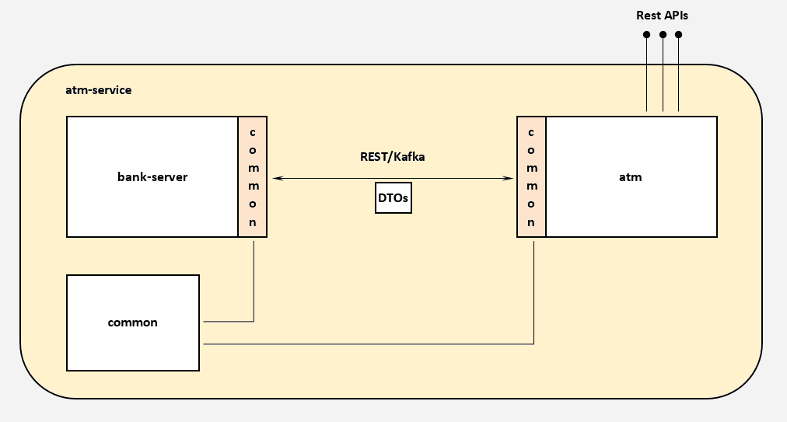
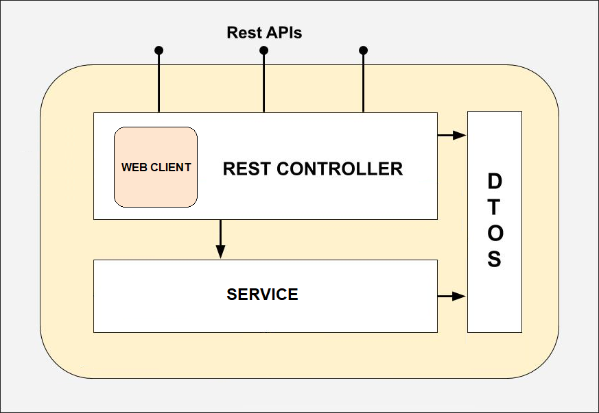
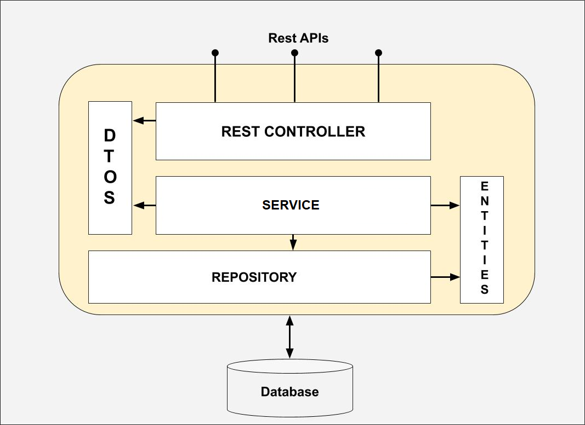

# atm-service
Многомодульный проект, реализующий модель взаимодействия банкомата и сервера.   
[Техническое задание](description/TODO.md)  

# Структура  
* **atm** - модуль, обеспечивающий первичную обработку клиентского запроса и обращение к **bank-server**'у.  
* **common** - модуль, предоставляющий Data Transfer Object (DTO) для обеспечения взаимодействия модулей **bank-server** и **atm**.      
* **bank-server** - модуль, обеспечивающий обработку запроса от **atm**, взаимодействие с хранилищем данных и формирование ответа на запрос.  

  

## Модуль atm  
Структура модуля представлена на рисунке:  


### Exceptions
| Исключение                        | Описание                                                                                                 |
|-----------------------------------|----------------------------------------------------------------------------------------------------------|
| NotFoundException                 | На стороне **bank-server** отсутствует информация о клиенте с указанными учетными данными (№ карты, ФИО) |
| UnauthorizedException             | Не удалось получить права для доступа к ресурсам **bank-server**'a                                       |
| InternalBankServerErrorException  | Непредвиденная ошибка на стороне **bank-server**'a                                                       |

### DTO ResponseToClient
| Тип                 | Поле          |
|---------------------|---------------|
| String              | clientName    |
| Map<String, String> | accountsView  |
| String              | pinCodeStatus |

## Модуль bank-server
Структура модуля представлена на рисунке:  

### Exception
| Исключение              | Описание                                                                                       |
|-------------------------|------------------------------------------------------------------------------------------------|
| ClientNotFoundException | В базе данных отсутствует клиент с фамилией и именем или номером карты, полученными от **atm** |
### Database
В проекте задействована H2Database.  
Учетные данные для подключения указаны в `application.properties`.  
#### Таблица Client

| ID (Primary key)   | FIRST_NAME | PATRONYMIC | LAST_NAME |
|--------------------|------------|------------|-----------|

```roomsql
CREATE TABLE CLIENT (  
    ID BIGINT GENERATED BY DEFAULT AS IDENTITY (START WITH 0) NOT NULL PRIMARY KEY,  
    FIRST_NAME VARCHAR NOT NULL,  
    PATRONYMIC VARCHAR NOT NULL,  
    LAST_NAME VARCHAR NOT NULL  
);  
```
#### Таблица Account

| ID (Primary key)   | OWNER_ID (Foreign key) | ACCOUNT_NUMBER | CARD_NUMBER | PIN_CODE | AMOUNT | CURRENCY |
|--------------------|------------------------|----------------|-------------|----------|--------|----------|

```roomsql
CREATE TABLE ACCOUNT (  
    ID BIGINT GENERATED BY DEFAULT AS IDENTITY (START WITH 0) NOT NULL PRIMARY KEY,
    OWNER_ID BIGINT NOT NULL,
    ACCOUNT_NUMBER VARCHAR NOT NULL UNIQUE,
    CARD_NUMBER BIGINT CHECK (CARD_NUMBER  > 0),
    PIN_CODE INT,
    AMOUNT NUMERIC(20, 2) NOT NULL DEFAULT 0.00,
    CURRENCY VARCHAR(3) NOT NULL,
    FOREIGN KEY (OWNER_ID ) REFERENCES CLIENT(ID)
);
```
## Модуль common
### DTO RequestFromAtm 
`-> to bank-server`

| Тип    | Поле       |
|--------|------------|
| String | firstName  |
| String | lastName   |
| long   | cardNumber |
| int    | pinCode    |

### DTO ResponseToAtm 
`<- from bank-server`

| Тип                 | Поле                   |
|---------------------|------------------------|
| String              | firstname              |
| String              | patronymic             |
| Map<String, String> | accountsAndBalances    |
| PinCodeStatus       | pinCodeStatus          |
### Enum PinCodeStatus  
| Элемент перечисления |
|----------------------|
| OK                   |
| INVALID              |

# Безопасность
В соответствии с требованием ТЗ, для обеспечения безопасности в проекте задействован проект Spring Security.  
Реализована базовая аутентификация (Basic HTTP Authentication) клиента - в данному случае **atm** - по логину и паролю.  

Логин и пароль задаются в `application.property`.
> Применение такого типа аутентификации оправдано требованиями ТЗ и статусом проекта (учебный).  

# Общий принцип работы
### 1. Клиент (может представлять собой front-end банкомата) запрашивает у **atm** баланс банковской карты  
>Предполагается, что информация о банковской карте (номер, имя клиента, вводимый пин-код) из соображений безопасности передаются в теле
запроса, однако для удобства тестирования и демонстрации работы проекта эти данные жестко прописаны в свойствах модуля **atm**.  

### 2. Модуль **atm** формирует запрос и отправляет его на **bank-server**  
2.1 На уровне контроллера из полученных данных формируется тело запроса (RequestFromAtm).  
2.2 Для обеспечения авторизации формируется соответствующий заголовок. Учетные данные кодируются на сервисном слое.  
2.3 Посредством **WebClient** заголовки и тело в формате **JSON** транслируются на указанный URL.  
2.4 Ожидается ответ...

### 3. Модуль **bank-server**, получив запрос от **atm**, обращается к базе данных, извлекает необходимую информацию и формирует ответ   
3.1 При обращении к ресурсам **bank-server**'a запрос проходит через **SecurityFilterChain**, где проверяется на наличие 
в запросе заголовка для авторизации. В случае отсутствия или несоответствия значения, заданного на стороне сервера, со
значением в заголовке, запрос отклоняется с кодом ошибки 401.  
3.2 Слой контроллера отвечает за обработку запроса после авторизации клиента, которая заключается в обращении к сервисному слою.  
3.3 Сервис извлекает из тела запроса имя и фамилию клиента, с которыми обращается к слою репозитория для получения информации из базы данных.  
> Механизм **spring-data-jdbc** позволяет абстрагироваться от конкретизации SQL-запросов и автоматизировать процесс сопоставления полей 
java-объектов (entity классов) и записей таблиц.  

3.4 Полученные данные формируют набор сущностей **Client**, каждая из которых содержит исчерпывающую информацию о клиенте, в том числе - набор сущностей **Account** с информацией о счетах клиента.  
3.5 Из набора клиентов выбирается единственный, обладающий номером карты, поступившим с HTTP-запросом.
> В случае отсутствия подходящего клиента возникает исключительная ситуация - выбрасывается **ClientNotFoundException**.  

3.6 Из сущности **Client** извлекаются (при наличии) сущности **Account**, соответствующие критериям поиска: номер карты и пин-код.
> Клиент банка может иметь несколько счетов, в том числе - не карт-счета.  

3.7 Регистрируется статус пин-кода:   
- если ни один **Account** не был найден, то (учитывая п.3.5) переданный в HTTP-запросе пин-код не соответствует пин-коду в базе данных;
- иначе, получен корректный пин-код.
> Регистрация статуса пин-кода позволяет избежать броска исключения и предусматривает возможность расширения функционала, а именно добавления счетчика попыток ввода пин-кода и вытекающих разрешений/ограничений.

3.8 Данные о клиенте, его аккаунтах и статусе пин-кода используются для формирования DTO (ResponseToAtm).  
3.9 ResponseToAtm возвращается на слой контроллера, средствами **Spring** преобразуется в **JSON** и в качестве тела ответа отправляется на **atm**.  
### 4. Модуль atm получает ответ от bank-server'а, преобразует его и отправляет в ответ клиенту (front-end банкомата)
4.1 **WebClient** получает ожидаемый ответ и проверяет его статус (Response Status Code). При получении ответа с кодом ошибки, клиенту отправляется соответствующий ответ.  
4.2 К "успешному" ответу применяется метод сервисного слоя, выполняющий его преобразования.  
4.3 Измененный ответ отправляется запросившему его клиенту.

# Запуск
В модулях проекта используется **spring-boot-maven-plugin**, позволяющий собирать модули в самодостаточные .jar архивы.  
Таким образом, для запуска достаточно команды `java -jar filename.jar`.

**Atm** server port: `8081`  
**Bank-server** port: `8080`

Конфигурационные файлы расположены по пути `src\main\resources\application.properties`.


# Конечные точки и примеры запросов

##atm:
###Base URL: `http://localhost:8081`  

**Запрос инфо и баланса**: `GET /balance` или `GET /balance?atmNumber={id}`  
- Response: [ResponseToClient](#DTO-ResponseToClient) 
- Errors: 401 ([UnauthorizedException](#Exceptions)), 404 ([NotFoundException](#Exceptions)), 500 ([InternalBankServerErrorException](#Exceptions))  

> Параметр запроса atmNumber может быть использован для идентификации банкомата и логирования исключительных ситуаций.   
> Добавлен в проект в качестве отправной точки для расширения функционала логирования.  

```
200 OK:
curl http://localhost:8081/balance -i
```
```
200 OK:
curl http://localhost:8081/balance?atmNumber=178 -i
```

## bank-server:
###Base URL: `http://localhost:8080`

**Запрос инфо о клиенте**: `POST /clientInfo`
- Request: [RequestFromAtm](#DTO-RequestFromAtm)
- Response: [ResponseToAtm](#DTO-ResponseToAtm)
- Error: 404 ([ClientNotFoundException](#Exception))

```
200 OK:

Multiple accounts:
curl -X POST http://localhost:8080/clientInfo -H "Content-Type: application/json" -H "Accept: application/json" -d "{\"firstName\":\"IVAN\",\"lastName\":\"IG\",\"cardNumber\":\"1616161616161111\",\"pinCode\":\"1234\"}" --user ATM:Pass

Single account:
curl -X POST http://localhost:8080/clientInfo -H "Content-Type: application/json" -H "Accept: application/json" -d "{\"firstName\":\"AFANASII\",\"lastName\":\"FET\",\"cardNumber\":\"1616161616162222\",\"pinCode\":\"1234\"}" --user ATM:Pass

Invalid pin-code:
curl -X POST http://localhost:8080/clientInfo -H "Content-Type: application/json" -H "Accept: application/json" -d "{\"firstName\":\"AFANASII\",\"lastName\":\"FET\",\"cardNumber\":\"1616161616162222\",\"pinCode\":\"9999\"}" --user ATM:Pass

```
```
401 Unauthorized:

curl -X POST http://localhost:8080/clientInfo -H "Content-Type: application/json" -H "Accept: application/json" -d "{\"firstName\":\"IVAN\",\"lastName\":\"IG\",\"cardNumber\":\"1616161616161111\",\"pinCode\":\"1234\"}"
```
```
404 NotFound:

curl -X POST http://localhost:8080/clientInfo -H "Content-Type: application/json" -H "Accept: application/json" -d "{}" --user ATM:Pass
```


# Тесты

Модули покрыты unit- и полуинтеграционными тестами.  
В `application.properties` модуля **atm** представлены различные кейсы для ручного тестирования. 


# Использованные технологии
* База данных: H2DB  
* ORM: Spring Data JDBC
* Репозиторий: Spring Data JDBC
* Контроллер: Spring Web MVC
* Клиент для выполнения HTTP-запросов: Spring WebClient
* Контейнер сервлетов: Tomcat
* Аутентификация/Авторизация: Spring Security (Basic Authentication)
* Тесты: JUnit, Mockito, OkHttp, Reactor-test
* Логирование: SLF4J
* Сборка проекта: Maven
